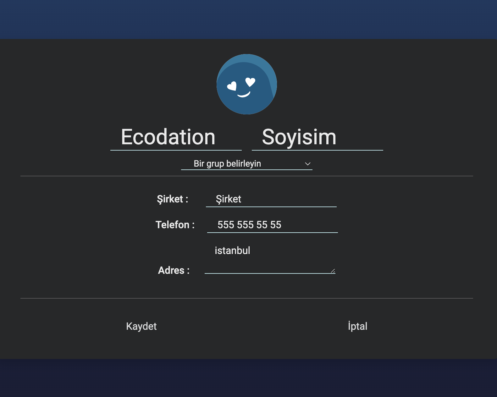

# KULLANICI REHBERİ - ECODATION

Bu projede benden istebildiği şekilde;
- Kullanıcı kişi listesi sayfası ile uygulamaya giriş yapıyor.
- Sağ artı ikonu yeni kişi ekleme formu açılmaktadır.
- Kullanıcı dilediği bilgilerle adres, şirket vb. yeni kişiyi doldurabilir ancak isim ve telefon numarası girmesi zorunludur.
- Sol menü ikonu ile filtrelemelerini tercih edebilir. Aile, arkadaş vs. olarak gruplandırabiliyor.
- Listelenen kişileri direkt listeden silebiliyor.
- Kişiye liste üzerinde iki kere tıklayınca ya da detay ikonu ile de kişinin kişisel tüm bilgilerini görüntüleyebildiği detay sayfasına yönlendiriliyor.
- Detayları fdüzenlemek istemezse geri ikonu ile de listeye dönebilir.
- Kullanıcı bu sayfada da sol edit ikonu ile kişi bilgilerini düzenleyip kaydedebilir ya da düzenlemeyi iptal edebilir.
- Listenin en altında sticky olarak sabit şekilde duran kişi sayısı görüntülenmektedir.
- Tasarımı da kullanışlı ve okunaklı şekilde yapmaya çalıştım, responsive olması sayesinde her ekrana uyum sağlayacaktır.

##### Projemin netfly linki: https://imaginative-puffpuff-f88793.netlify.app 

#### Anasayfa

### Yeni Kişi Ekle

### Filtreleme Menüsü

### Kişi Detayı

### Detay Düzenleme Formu

###### Created By Büşra Tuğul - 11.01.2024